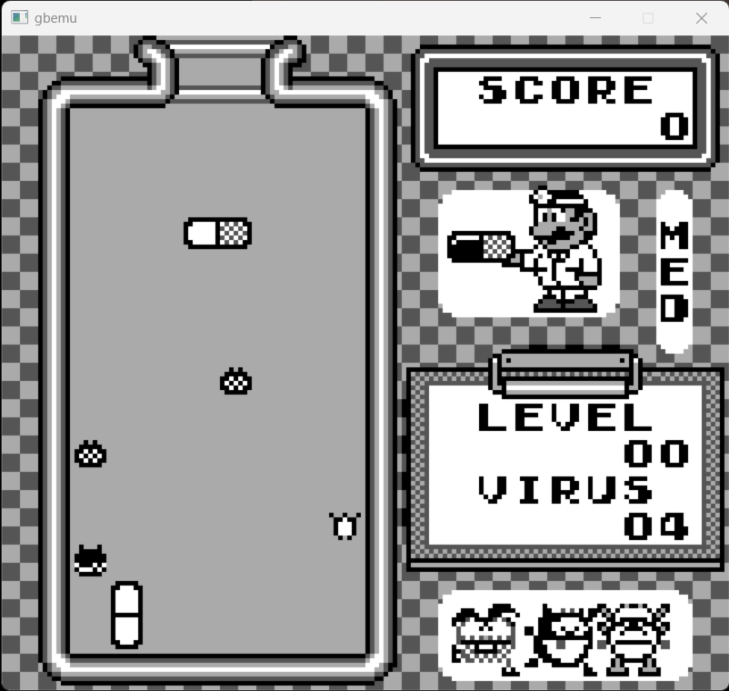
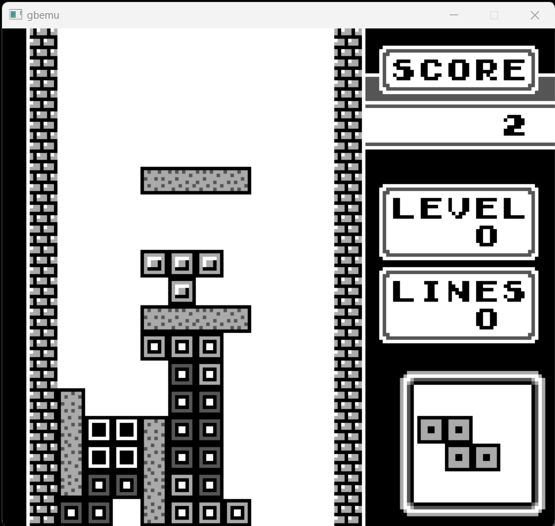

# Gameboy Emulator

Gameboy emulator, built using Rust for learning purposes.

## Run Instructions

```bash
# Running ROM
cargo run -- -p "relative path to rom" 

# List different cli options
cargo run -- --help 
```

## Controls
| Keyboard   |    Input     |
| :--------: | :----------: |
|    W       |   Dpad Up    | 
|    S       |  Dpad Down   |
|    A       |  Dpad Right  |
|    D       |  Dpad Left   |
|    J       |      A       |
|    K       |      B       |
|    U       |   Select     |
|    I       |   Start      |

## Images





## Dependencies
- [rust_minifb](https://github.com/emoon/rust_minifb) Framebuffer for displaying the lcd output and keyboard input

## Test roms
Blarrg's test roms can be found at [gb-test-roms](https://github.com/retrio/gb-test-roms.git).

## Tasks

- [x] Pass all individual CPU instruction tests
- [ ] Add more mappers
- [ ] Run using WASM
- [ ] Display on browser

